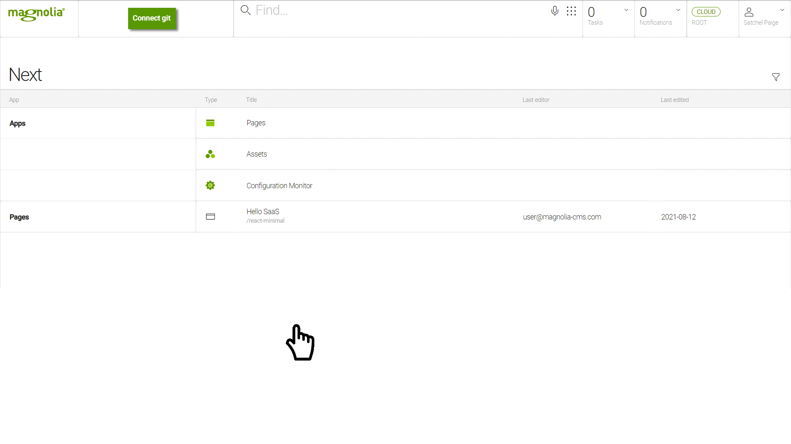

= Connect git to SaaS
:revealjsdir: https://github.com/alex-at-magnolia/adoc-slides/tree/master/reveal.js/

== {empty}

== Which Git provider do you use?

++++

++++

++++
<button class="saas">GitHub</button>
++++

++++
<button class="saas">Bitbucket</button>
++++

== Enter your Git repo SSH URL

++++
<input></input>
++++

++++
<button class="saas">Apply</button>
++++

== Copy the Webhook URL and Secret

Copy the webhook URL and secret below and use them to set up the webhook on your git provider.

++++
<input placeholder="https://webhook.saas.magnolia-cloud.com/github/g5gpiqafja7szisf"></input>&#128203;
++++

++++
<input placeholder="********"></input>&#128203;
++++

{sp} +

NOTE: Here are some link:https://saas-docs.beta.de.magnolia-cloud.com/saas/[instructions^] to help out.

== Copy the SaaS public key

Copy the SaaS public key and add it on your git provider.

++++
    <textarea rows="5" cols="60" name="text" placeholder="ssh-rsa AAAAB3NzaC1yc2EAAAADAQABAAABAQCqymHPEBc0jphgjpqp2Fpmu7NUl3g58RdpnhlAkkmTY2p0I3xwXODeOtFI3shhzjan//w4C7aTnEF7bupB6SCqDB0IVMcu9i9XaA/ykfNmc0GXPnrqs7iJFlA8gk/IksnrEyeX4A5iBv/xdsNJZWZ8c6lvD0Q0RmuxX7x34m4wAF922kgO7HMt6LYy7LoUrp6qVuC/evc+565YQeOzfdSwp88SmfpPUSo9dG25itxMYEHPZPNG2y2+TubZWKBzUaakUSwVnbo6OFpfDb9Dh4zAG39g/WY853AMei763RHqm7mrr7g/boz7DdpYR4uwIurWV6q6ZetO/a3B0jznvhq/ Generated by Magnolia Cloud"></textarea>
     
    <button class="saas">Copy</button>
++++

{sp} +

NOTE: Here are some link:https://saas-docs.beta.de.magnolia-cloud.com/saas/[instructions^] to help out.

== Sync your repo to SaaS

++++
<button class="saas">Sync now</button>
++++

== Get started

Try out SaaS with our link:https://saas-docs.beta.de.magnolia-cloud.com/saas/hello-saas/[Hello SaaS tutorial^].